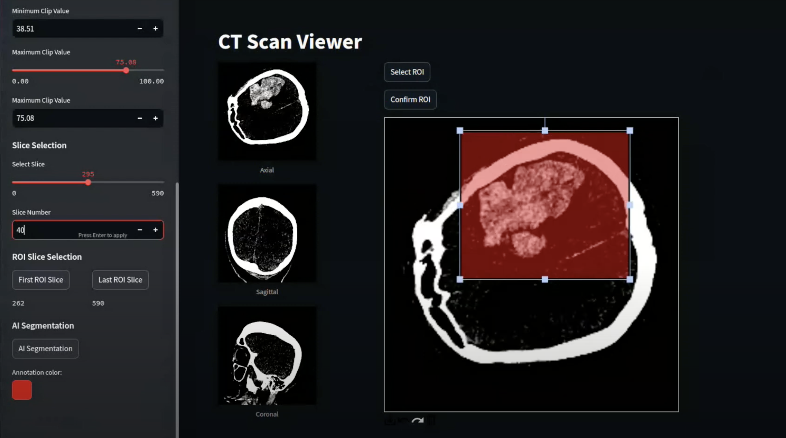

# Adapting Foundation Models for Rapid Clinical Response: Intracerebral Hemorrhage Segmentation in Emergency Settings []() 

Official Repo of the paper "Adapting Foundation Models for Rapid Clinical Response: Intracerebral Hemorrhage Segmentation in Emergency Settings" - [Alessia Gerbasi](https://scholar.google.com/citations?user=zzZZp_UAAAAJ&hl=it) et al.

Intracerebral hemorrhage (ICH) is a critical condition that demands rapid and accurate diagnosis for optimal patient management. Traditional manual segmentation of hemorrhagic lesions in CT scans is time-consuming and prone to inter-rater variability, creating a need for automated solutions.

This repository presents a web application for automating the segmentation of intracerebral hemorrhage (ICH) lesions in non-contrast CT scans. Combining a fine-tuned YOLOv8-S model for bounding box detection with the Segment Anything Model (MedSAM) for segmentation, the tool achieves high accuracy and robustness across variable lesion shapes and sizes. Designed for efficiency, the pipeline minimizes user input and integrates radiomic quantification, offering clinicians a user-friendly interface for enhanced diagnosis and patient management.

#### Video tutorial

[](https://youtu.be/uK7eDUeIFZM)

### Python requirements 
python > 3.7, this code has been tested with python 3.10.
All the required packages are listed in the `requirements.txt` file.
!! Please note that for the radiomic feature extraction we used [pyradiomics](https://pyradiomics.readthedocs.io/en/latest/index.html) library which only supports Python 3.7. To avoid downgrading the Python version of the entire environment we created in the main project path a conda virtual environment named radiomics (located in web_app/venv_radiomics/radiomics) which is automatically loaded by the page computing the features. 
Supported input file format: nii or nii.gz

### Model weights
If you want to download our model weights please compile [this form](https://docs.google.com/forms/d/e/1FAIpQLSfCCLcsSPbZPWHf28X4nAdUCdM19x-ldPqZr6v_8CD3JrN8Ug/viewform?usp=header)

## Citation
If you find this work useful for your research, please cite our paper:
```
@misc{
}
```